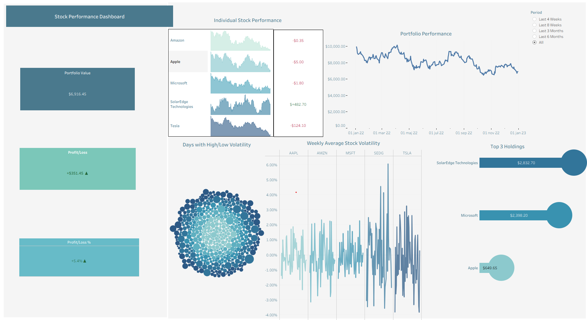
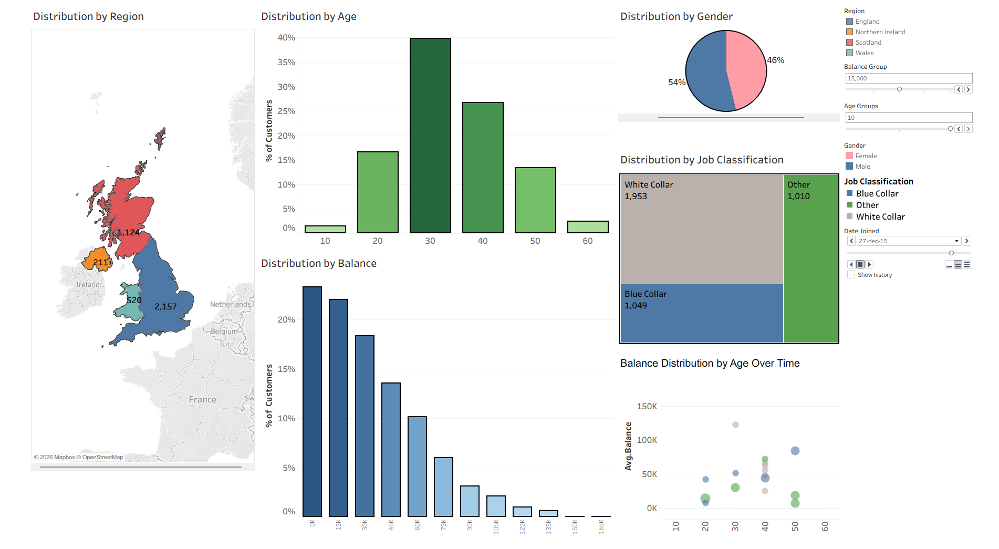

# Tableau Projects

## 1. Stock Performance Dashboard

Personal stock portfolio tracker analyzing 5 stocks (AAPL, AMZN, MSFT, SEDG, TSLA) 
across 2022, built with two connected data sources (stock prices + portfolio list).

**Visualizations built:**
- Stock Area Charts — individual price history per stock
- P/L Chart — profit/loss per stock with color coding
- Portfolio Performance line chart — total portfolio value over time
- Bubble Chart — days with high/low volatility
- Volatility Chart — weekly average % change per stock
- Lollipop Chart — Top 3 Holdings by current value
- KPI Cards — Portfolio Value ($6,916), P/L (+$351), P/L % (+5.4%)

**Technical skills used:**
- Joined two Excel data sources (Stocks + Portfolio)
- Calculated fields: Current Value, Daily Value, P/L, Profit/Loss %, Red/Green, Period Filter, Clean Stock Name, Top 3 Stocks
- Period parameter (Last 4/8 Weeks, 3/6 Months, All)
- Action filters for interactivity between charts

---

## 2. UK Bank Customer Analysis Dashboard

Analysis of 4,012 UK bank customers across England, Scotland, Wales 
and Northern Ireland.

**Visualizations built:**
- Map — customer count by UK region
- Pie Chart — gender distribution (54% Male, 46% Female)
- Bar Chart — age distribution (binned)
- Bar Chart — balance distribution (binned)
- Treemap — job classification (White Collar, Blue Collar, Other)
- Animated Scatter Plot — average balance by age over time

**Technical skills used:**
- Geographic map with filled regions
- Bins for age and balance grouping
- Parameters: Age Groups slider, Balance Group slider
- Animation through time using Pages shelf
- Action filters connecting all charts interactively

